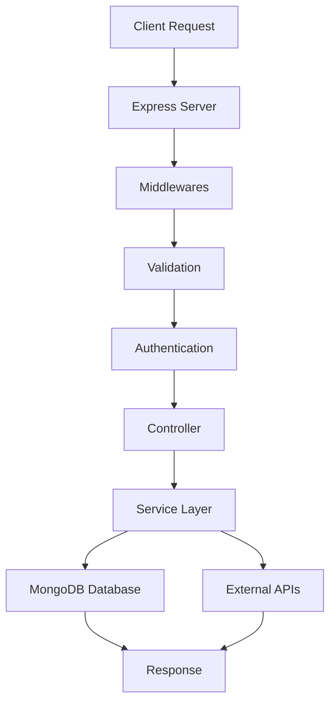
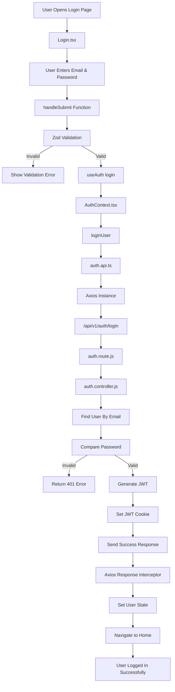

# 🚀 Stellar E-Commerce Backend API

A fully scalable, secure, enterprise-grade, and production-ready E-Commerce Backend API built with modern backend architecture and best practices.

Designed for:

- Production Applications
- Real MERN Stack Projects
- Enterprise-Level Scaling
- Secure Authentication Systems
- High Performance APIs

---

# 🌍 Live Architecture Overview

```txt
Frontend (React / Next.js)
        ↓
Axios API Layer
        ↓
Express.js REST API
        ↓
Controllers
        ↓
Services Layer
        ↓
MongoDB Database
        ↓
JWT Authentication + Cookies
```

---

# ⚡ Tech Stack

| Technology | Purpose |
|---|---|
| Node.js | JavaScript Runtime |
| Express.js | Backend Framework |
| MongoDB | NoSQL Database |
| Mongoose | MongoDB ODM |
| JWT | Authentication |
| bcryptjs | Password Hashing |
| cookie-parser | Cookie Handling |
| Helmet | Security Headers |
| Compression | Response Compression |
| Morgan | Request Logging |
| HPP | HTTP Parameter Pollution Protection |
| express-rate-limit | API Rate Limiting |
| express-mongo-sanitize | MongoDB Injection Protection |

---

# 📁 Production Folder Structure

```bash
src/
├── config/
│   ├── db.js
│   └── constants.js
│
├── controllers/
│   ├── auth.controller.js
│   ├── product.controller.js
│   ├── order.controller.js
│   └── user.controller.js
│
├── middlewares/
│   ├── auth.middleware.js
│   ├── error.middleware.js
│   ├── validate.middleware.js
│   └── rateLimiter.middleware.js
│
├── models/
│   ├── user.model.js
│   ├── product.model.js
│   ├── order.model.js
│   ├── coupon.model.js
│   └── review.model.js
│
├── routes/
│   ├── index.route.js
│   ├── auth.route.js
│   ├── product.route.js
│   ├── order.route.js
│   └── user.route.js
│
├── services/
│   ├── email.service.js
│   └── payment.service.js
│
├── utils/
│   ├── ApiResponse.js
│   ├── ApiError.js
│   ├── asyncHandler.js
│   └── generateAuthToken.js
│
├── validators/
│   ├── auth.validator.js
│   └── product.validator.js
│
├── app.js
└── server.js
```

---

# 🧠 Architecture Principles

This project follows:

✅ MVC Architecture  
✅ Separation of Concerns  
✅ Reusable Services  
✅ Modular Structure  
✅ Clean Code Practices  
✅ Enterprise Scalability  
✅ Production Security Standards  

---

# 🔐 Authentication System

This backend uses:

```txt
JWT + HTTP Only Cookies
```

Authentication Flow:

```txt
User Login
    ↓
Validate Credentials
    ↓
Generate JWT
    ↓
Store JWT in Secure HTTP Only Cookie
    ↓
Access Protected Routes
```

---

# 🍪 Cookie Authentication

JWT token is stored inside:

```txt
HTTP Only Secure Cookie
```

Benefits:

✅ More Secure  
✅ Prevents XSS Attacks  
✅ Safer Than LocalStorage  
✅ Production Recommended  

---

# 🛡️ Security Features

This backend includes enterprise-level security middleware.

| Middleware | Purpose |
|---|---|
| helmet | Secure HTTP headers |
| compression | Compress response size |
| morgan | API request logging |
| express-rate-limit | Prevent API abuse |
| hpp | Prevent parameter pollution |
| express-mongo-sanitize | Prevent MongoDB injection |
| cookie-parser | Read cookies |

---

# ⚡ Security Flow

```txt
Client Request
      ↓
Helmet Security
      ↓
Rate Limiting
      ↓
Mongo Sanitize
      ↓
HPP Protection
      ↓
Validation Middleware
      ↓
Authentication Middleware
      ↓
Controller
      ↓
Database
```

---

# 📦 Installation

## 1️⃣ Clone Repository

```bash
git clone <repository_url>
```

---

## 2️⃣ Move Into Project

```bash
cd backend-E-commece
```

---

## 3️⃣ Install Dependencies

```bash
npm install
```

---

# 🔐 Environment Variables

Create `.env` file in root directory.

```env
PORT=5000

NODE_ENV=development

MONGO_URI=your_mongodb_connection

JWT_SECRET=your_super_secret_key

CLIENT_URL=http://localhost:5173
```

---

# ▶️ Run Application

## Development

```bash
npm run dev
```

---

## Production

```bash
npm start
```

---

# 🌐 API Base URL

```txt
http://localhost:5000/api/v1
```

---

# 🔑 Authentication APIs

---

# Register User

### Endpoint

```http
POST /api/v1/auth/register
```

### Request Body

```json
{
  "username": "faiq",
  "email": "faiq@example.com",
  "password": "123456"
}
```

### Response

```json
{
  "success": true,
  "message": "User registered successfully",
  "data": {
    "_id": "123",
    "username": "faiq",
    "email": "faiq@example.com",
    "role": "user"
  }
}
```

---

# Login User

### Endpoint

```http
POST /api/v1/auth/login
```

### Request Body

```json
{
  "email": "faiq@example.com",
  "password": "123456"
}
```

---

# Logout User

### Endpoint

```http
POST /api/v1/auth/logout
```

---

# 🧠 Backend Request Lifecycle



---

# 🔥 Frontend → Backend Login Flow



---

# ⚡ Production Optimizations

Included optimizations:

✅ Response Compression  
✅ Secure HTTP Headers  
✅ API Request Logging  
✅ Global Error Handling  
✅ JWT Cookie Authentication  
✅ Validation Layer  
✅ Rate Limiting  
✅ Mongo Injection Protection  
✅ HTTP Parameter Pollution Protection  

---

# ❌ Global Error Handling

Centralized error handling implemented.

Example Error Response:

```json
{
  "success": false,
  "message": "Invalid credentials"
}
```

---

# 🧪 Testing

Future testing support:

- Jest
- Supertest
- Integration Testing
- API Testing

Test folder:

```bash
src/test
```

---

# 🚀 Deployment Ready

Compatible with:

✅ Render  
✅ Railway  
✅ VPS  
✅ AWS  
✅ DigitalOcean  
✅ Docker  
✅ Vercel Backend  
✅ Nginx Reverse Proxy  

---

# 📌 Future Improvements

Planned enterprise features:

- Refresh Tokens
- Email Verification
- Forgot Password
- Role-Based Access Control
- Product Management APIs
- Order Management
- Payment Gateway Integration
- Redis Caching
- Swagger Documentation
- CI/CD Pipeline
- Dockerization
- Microservices Support

---

# 👨‍💻 Developer

Muhammad Faiq

Full Stack MERN Developer

---

# 📄 License

This project is licensed under the MIT License.
